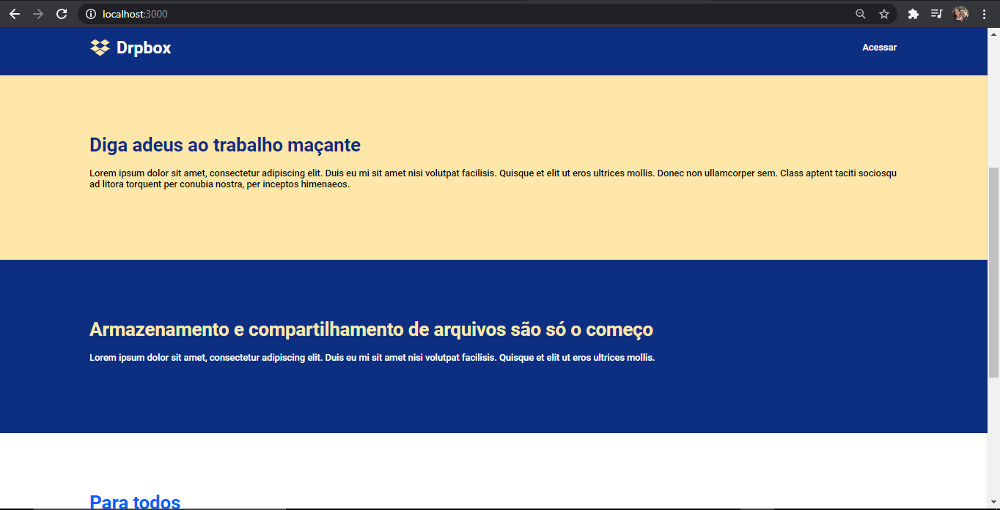
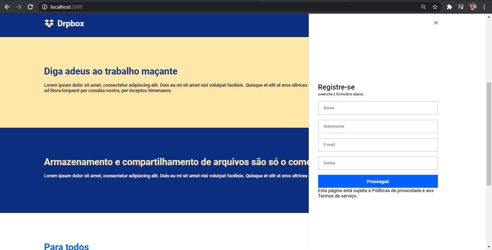
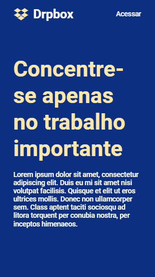
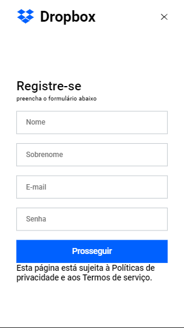

# DropBox cloning.

## The cloning of this site focuses more on the interactive menu, as it uses a css function to modify during scroll movements.
## This cloning was addressed by the Rocketseat team due to this differentiated function.

## The image below shows the cloning start screen:

## The texts were pre-established in the index.ts file in the data folder. Thus leaving the whole project more dynamic and efficient.

## The next image shows the registration menu. This menu is on the right side of the screen and moves smoothly from right to left. In addition, it has some interesting features, as when pressing the access / interact button it will open the menu, however, when the user moves it, it goes out and is hidden.

## The next images will show the mobile version of this cloning. It is worth mentioning that first the mobile version was made and then the Pc version.

### Thanks!
